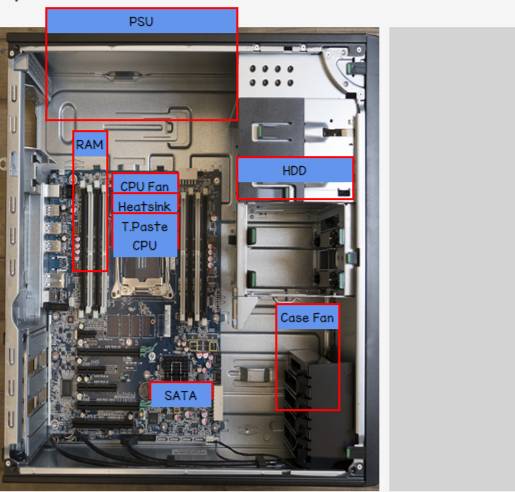

# Technical Support Fundamentals | Week-2

### Question 1

In this quiz, you will assemble a computer virtually by dragging-and-dropping the components to the corresponding  sections.

In the CPU section, you will need to place the 4 items in the correct order, from bottom to top (as shown in the picture below), as if it were a physical computer.

